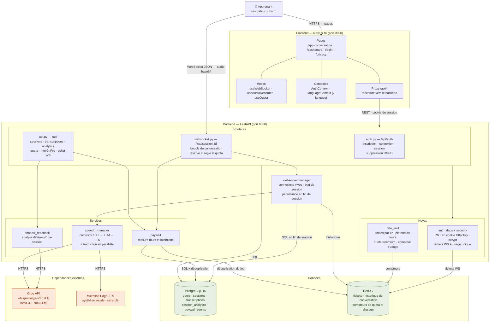
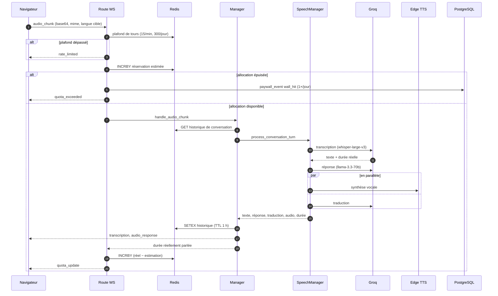

# Architecture — Takalam (تكلم)

État au 4 août 2026. Établi en lisant le code, pas l'intention : ce qui figure
ici existe réellement dans le dépôt.

## Vue d'ensemble

**Le point d'entrée utilisateur est unique** : le navigateur, sur `/app`. Deux
canaux en partent — le REST passe par le proxy Next, le WebSocket attaque le
backend directement (il ne peut pas être proxifié, la CSP l'autorise
explicitement).

## Un tour de conversation

C'est le chemin critique : tout ce qui coûte de l'argent s'y trouve.

La réservation avant transcription et le règlement après sont **au même
endroit**, dans la route : c'est ce qui garantit qu'un tour échoué, refusé ou
concurrent rend son estimation. Un tour sans réponse ne coûte rien à
l'apprenant.

## Ce qui est stocké, et où

### PostgreSQL — la vérité durable

| Table | Contenu | Notes |
|---|---|---|
| `users` | identité, mot de passe bcrypt, `plan`, `plan_updated_at` | `plan` est la seule source d'autorité pour l'accès Pro |
| `sessions` | une conversation, début, fin, durée | écrite à la fermeture de session |
| `transcriptions` | chaque réplique, locuteur, langue | |
| `session_analytics` | corrections grammaticales, vocabulaire nouveau, mots prononcés | remplie en tâche de fond après la session ; les colonnes `fluency_score` et `confidence_level` subsistent mais ne sont plus écrites |
| `paywall_events` | `wall_hit` et `interest` | numérateur et dénominateur de la conversion |
| `alembic_version` | révision de schéma | **à vérifier avant tout déploiement** (voir `PRODUCTION_CHECKLIST.md`) |

### Redis — l'éphémère et les compteurs

| Clé | Rôle | Durée de vie |
|---|---|---|
| `ws_ticket:{ticket}` | ticket WebSocket à usage unique | 60 s |
| `conv_history:{user}:{session}` | historique envoyé au LLM | 1 h, prolongée à la reconnexion |
| `ws_turns:min:{user}` · `ws_turns:day:{user}` | plafond anti-abus, tous plans confondus | 60 s · 24 h |
| `quota:spoken:{user}:{date}` | allocation quotidienne consommée | 48 h |
| `paywall:wall_hit:{user}:{date}` | déduplication du mur | 48 h |
| `usage:spoken:all:{date}` | secondes transcrites, tous utilisateurs | 48 h |
| `LIMITS:LIMITER/...` | fenêtres de slowapi, par IP | selon la règle |

**La date UTC dans la clé *est* le mécanisme de remise à zéro** : pas de tâche
planifiée, un nouveau jour est simplement une nouvelle clé.

## Dépendances externes

| Service | Usage | Clé requise | Si indisponible |
|---|---|---|---|
| **Groq** | transcription, réponse, traduction, analyse | `GROQ_API_KEY` | le tour échoue et rend sa réservation |
| **Edge TTS** | synthèse vocale | aucune | le tour échoue, aucun coût |
| OpenAI, ElevenLabs | déclarés, **non utilisés** par défaut | optionnelles | — |

## Deux précisions qui évitent des malentendus

**Il n'y a pas de file de messages.** `celery` figure dans `requirements.txt`
mais aucun code ne l'importe : l'analyse de session passe par les
`BackgroundTasks` de FastAPI, dans le processus de l'API. Une tâche perdue au
redémarrage est perdue — acceptable pour une analyse rejouable, à revoir si
d'autres traitements différés apparaissent.

**Il n'y a pas de microservices.** Un backend FastAPI, un frontend Next, deux
bases. Les « services » du diagramme sont des modules Python dans le même
processus ; les flèches entre eux sont des appels de fonction, pas du réseau.
Seuls les liens marqués REST, WebSocket, SQL ou HTTPS traversent un socket.
